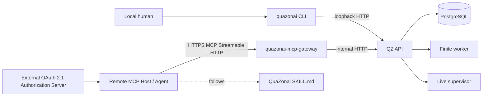

# QuaZonai CLI、MCP Gateway 与远程 AI Agent Skill 技术设计

> 文档状态：目标方案，尚未实现。  
> 适用分支：`main`。  
> 上位事实源：[`DESIGN.md`](DESIGN.md)。本文件展开本地 CLI、可选 MCP 边缘适配器和外部 Agent Skill；不得修改 `DESIGN.md` 已确定的 Research、Approval、Deployment、风险、Recovery 或交易事实。

## 1. 结论

QuaZonai 使用两条正式操作通道：

```text
本地人类操作者
  → quazonai CLI
  → loopback QZ API

远程 AI Agent
  → MCP client
  → HTTPS MCP Streamable HTTP
  → optional quazonai-mcp-gateway
  → internal QZ API
```

**远程 Agent 不使用 SSH。** 不提供 SSH forced command、普通 Shell、端口转发、自定义 JSONL 隧道或远程终端包装器。

`quazonai-mcp-gateway` 是可选边缘适配器，不是 `DESIGN.md` 核心五服务启动拓扑的必选成员：

```text
Core services:
postgres / migrate / api / finite-worker / live-supervisor

Optional remote-agent edge:
quazonai-mcp-gateway
```

未启用 MCP 时，QuaZonai 的全部本地功能和 Core readiness 不受影响。

## 2. 目标与边界

### 2.1 本地 CLI

官方本地命令：

```text
quazonai
```

覆盖 `OPERATIONS.md` 中全部人工操作节点，包括：

- System Status；
- Plugin、Credential、Data Source、Execution Connection；
- Dataset、Strategy、Research、Experiment、Run；
- Approval；
- Deployment、Risk、Universe、Recovery；
- Secret 写入、Force Remove、真实资金 Canary 等 human-only 操作。

CLI 是薄客户端，不直接访问 PostgreSQL、Docker、Nautilus、Plugin Volume 或 Catalog。

### 2.2 远程 MCP

Agent 入口：

```text
https://<operator-domain>/mcp
```

目标：

- 使用标准 MCP Streamable HTTP；
- 通过 Tools、Resources、JSON Schema 和可选 Tasks 自描述能力；
- 通过 OAuth 2.1 scope 限制可见 Tool；
- 对 mutation 提供幂等、前置条件和影响确认；
- Core API 保持 loopback/internal，不公开 `/api/v1`；
- Secret、真实资金 Approval、Force Remove 和 Live Canary 保留给本地人工；
- Gateway 停机不影响本地 CLI、Core API、Run 或 Live Deployment。

### 2.3 Skill

`skills/quazonai/SKILL.md`：

- 只使用当前连接的 QuaZonai MCP Server；
- 从 `tools/list` 和 `quazonai://manifest` 获取运行时能力；
- 读取当前 Resource 后再 mutation；
- 生成 idempotency key 和 optimistic precondition；
- 跟踪 Task 或 QZ operation；
- 在 human-only 节点停止并生成 handoff；
- 不处理 OAuth token、Secret 或 Wallet material。

Skill 是外部工作流，不是 QZ 内置 Agent runtime，也不构成权限事实源。

## 3. 非目标

不建设：

- SSH transport、任意 Shell、远程命令执行器；
- 公网 Core API 或通用 HTTP proxy；
- QZ 内置 LLM、Agent scheduler、模型 provider；
- 业务用户、workspace、RBAC 或 SaaS 控制面；
- Agent Secret 输入/读取；
- Agent Approval approve/reject；
- Agent Force Plugin Remove、Live Canary、Master Key 或破坏性数据库操作；
- Agent raw order submission；
- Holdout、Recovery、Risk 或 Reconciliation bypass；
- MCP Sampling 驱动自治交易循环；
- Elicitation 收集密码、API key、token、private key 或支付凭据；
- 把大型文件 Base64 放入 MCP JSON；
- 服务器从任意远程 URL 抓取上传文件；
- 在 CLI/Gateway 中复制领域状态机或 Nautilus 金融事实。

`DESIGN.md` 中“无用户/workspace/auth”指不建设业务身份域。MCP OAuth 是可选远程边缘的传输授权，不改变 Core 产品模型。

## 4. 架构



固定边界：

- Core API 仅宿主 `127.0.0.1:8000` 和内部容器网络可达；
- Gateway 只公开 `/mcp`、OAuth protected-resource metadata 和 Artifact upload endpoint；
- Gateway 不暴露 `/api/v1`；
- Gateway 无 DB credential、Docker socket、Plugin/Catalog/Report/Wallet Volume；
- Gateway 只调用固定 QZ API operation；
- OAuth access token 不传给 Core API、Polymarket 或其他下游；
- CLI 与 MCP Tool 映射到相同领域动作和 Pydantic wire model。

## 5. 可选部署

### 5.1 Core

Core Compose 继续为：

```text
postgres
migrate
api
finite-worker
live-supervisor
```

### 5.2 MCP Edge

MCP 通过独立可选部署启用，例如：

```text
compose.mcp.yml
或
托管 ASGI edge service
```

入口：

```text
python -m quazonai.mcp.main
```

内部监听示例：

```text
0.0.0.0:8001
```

外部必须为：

```text
https://<operator-domain>/mcp
```

TLS 可由 Gateway 直接终止，或由操作者已有的托管 TLS endpoint 终止。仓库不恢复 Nginx，不把通用 Reverse Proxy 作为 QZ Core 组件。

允许公开路径：

```text
/mcp
/.well-known/oauth-protected-resource
/.well-known/oauth-protected-resource/mcp
/agent-artifacts/*
```

不得公开：

```text
/api/v1/*
数据库
容器管理
文件系统
```

Gateway 容器：

- read-only root filesystem；
- drop all capabilities；
- 无持久业务卷；
- 只访问内部 QZ API 与 OAuth metadata/JWKS；
- 上传内容流式转发到 QZ Artifact staging，不永久落盘。

## 6. MCP 协议

### 6.1 Transport

基线：MCP `2025-11-25` Streamable HTTP。

```text
POST /mcp
GET  /mcp       # optional SSE stream/resume
DELETE /mcp     # optional session close
```

要求：

- 每个请求携带 `MCP-Protocol-Version`；
- 支持 JSON 和按协议协商的 SSE；
- access token 每个 HTTP 请求重新校验；
- session ID 不是认证；
- 断线、超时或 Gateway 重启不等于取消底层 QZ 操作；
- 客户端不支持 server stream 时仍可通过 Tool/Resource polling 完成全部流程。

### 6.2 状态

V1 默认：

```text
stateless MCP request handling
+ QZ durable Job / Run / Event / Deployment
```

业务事实不得只保存在 MCP session 或 Task store。只有需要 subscription、server request 或 resumable notification 时才启用 stateful session。

### 6.3 HTTP 校验

Gateway 必须：

- 校验 Host；
- 对存在的 Origin 精确 allowlist；
- CORS 不允许 `*`；
- 限制 MCP JSON body，默认 1 MiB；
- 文件走独立 Artifact endpoint；
- 不把错误堆栈、token 或内部 URL 输出给客户端。

## 7. OAuth 2.1

### 7.1 角色

```text
MCP client    = OAuth client
Gateway       = protected resource / resource server
External IdP  = Authorization Server
```

QZ 不自行实现通用 Authorization Server。操作者配置现有、受信任的 OAuth/OIDC 服务。

### 7.2 Discovery

Gateway 提供 RFC 9728 Protected Resource Metadata：

```text
/.well-known/oauth-protected-resource
/.well-known/oauth-protected-resource/mcp
```

未授权响应包含：

```text
401 WWW-Authenticate: Bearer resource_metadata="..."
```

Metadata 声明精确 MCP resource URI、Authorization Server 和 scopes。

### 7.3 Flow

V1 支持预注册客户端：

- Human-delegated Agent：Authorization Code + PKCE S256；
- Unattended Agent：Client Credentials，仅获得机器允许 scopes。

不要求 Dynamic Client Registration。

### 7.4 Token validation

每次请求校验：

```text
signature
issuer
expiration / not-before
audience / resource
client_id / azp
subject when present
scopes
```

禁止：

- query-string token；
- ID token 代替 access token；
- 接受签发给其他 resource 的 token；
- token passthrough；
- token 写日志或 Tool Result。

### 7.5 Scope

建议：

```text
quazonai:read
quazonai:plugin:stage
quazonai:plugin:activate
quazonai:data:write
quazonai:connection:write
quazonai:research:write
quazonai:experiment:run
quazonai:deployment:create
quazonai:deployment:stop
quazonai:universe:propose
quazonai:approval:prepare
quazonai:artifact:upload
```

`tools/list` 按 scope 过滤。无权限调用返回 403/`insufficient_scope`。

永久 human-only 能力不是 scope：

```text
Credential Secret create/update/read
Approval approve/reject
Force Plugin Remove
Live-money Canary
Master Key
Destructive DB
Raw Order
Risk/Recovery/Holdout bypass
```

## 8. MCP Primitives

### 8.1 Tools

命名：

```text
quazonai.system.status
quazonai.plugin.list
quazonai.research.show
quazonai.experiment.start
quazonai.deployment.stop
```

每个 Tool 提供：

```text
name / title / description
inputSchema
outputSchema
annotations
execution.taskSupport
```

Tool Result：

- `structuredContent` 为正式机器结果；
- 同时提供短 TextContent；
- 不含 Secret；
- 业务失败使用 `isError=true` 和稳定 QZ code；
- malformed MCP request 使用 JSON-RPC protocol error。

Annotations：

```text
readOnlyHint
destructiveHint
idempotentHint
openWorldHint
```

它们只是客户端提示，服务器仍独立执行 OAuth scope、状态机和风险校验。

### 8.2 Resources

```text
quazonai://manifest
quazonai://operations
quazonai://system/status
quazonai://plugin-releases/{id}
quazonai://runtime-bundles/{id}
quazonai://datasets/{id}
quazonai://strategies/{id}
quazonai://research/{id}
quazonai://experiments/{id}
quazonai://runs/{id}
quazonai://runs/{run_id}/reports/{report_id}
quazonai://approvals/{id}
quazonai://deployments/{id}
quazonai://deployments/{id}/risk
quazonai://deployments/{id}/universe
```

Resource 是当前 QZ API 快照。Agent mutation 前必须重新读取；历史缓存和 notification 不是事实源。

### 8.3 Subscription

客户端支持时，可订阅 Run、Plugin Job、Approval、Deployment、Risk 和 Universe Resource。Gateway 从 QZ durable event stream 映射 `notifications/resources/updated`。断线后仍需重新读取 Resource。

### 8.4 Prompts 与 Elicitation

可选只读 Prompt：

```text
quazonai.review.research
quazonai.review.approval
quazonai.diagnose.recovery
```

Prompt 不执行 mutation。

Form Elicitation 只收集非敏感澄清。不得请求 password、API key、token、private key、wallet/payment credential。Approval 和 Secret 直接返回 human handoff。

## 9. Tool Catalog

### 9.1 Read

```text
quazonai.system.status
quazonai.plugin.list/show/impact
quazonai.bundle.list/show
quazonai.credential.list/show
quazonai.data_source.list/show
quazonai.execution_connection.list/show
quazonai.dataset.list/show
quazonai.strategy.list/show
quazonai.research.list/show
quazonai.experiment.show
quazonai.run.list/show/report
quazonai.approval.list/show
quazonai.deployment.list/show
quazonai.universe.show
quazonai.risk.show
quazonai.event.list
quazonai.artifact.show
```

### 9.2 Scoped mutation

```text
quazonai.plugin.stage/prewarm/activate/deactivate
quazonai.data_source.create/update/preflight
quazonai.execution_connection.create/update/preflight
quazonai.dataset.import_parquet_l2
quazonai.strategy.create/version_create
quazonai.research.create/section_set/activate
quazonai.experiment.create/start
quazonai.approval.prepare_decision
quazonai.deployment.create/stop/restart_request
quazonai.universe.revision_create
quazonai.artifact.begin_upload/finalize_upload/delete
```

Tool description 必须明确：

- Deployment create 不 Approval、不直接 Trading；
- Restart Request 只创建 Approval；
- Stop 撤单并停止新增交易，但不强平；
- Universe expansion 仍需人工 Approval；
- Plugin deactivate 进入 Drain，不立即杀死现有 Runner。

## 10. Mutation 可靠性

### 10.1 Idempotency

Mutation Tool 必填 UUID `idempotency_key`：

- 同 key + 同 Tool + 同 normalized arguments 返回原 receipt；
- 同 key 用于不同请求返回 `IDEMPOTENCY_KEY_REUSED`；
- JSON-RPC request ID 不是业务幂等键；
- 网络结果不确定时只复用原 key，不创建重复操作。

### 10.2 Preconditions

更新类 Tool 携带当前读取到的：

```text
state
content_revision
version_no
generation
plugin_release_id
runtime_bundle_id
updated_at
```

冲突返回 `PRECONDITION_FAILED`。Agent重新读取并重新规划，不盲重放。

### 10.3 Impact token

高影响但允许 Agent 发起的 Tool：

```text
plugin.activate
plugin.deactivate
deployment.stop
universe.revision_create
```

先调用 impact/preflight，获得短时 `impact_token`。Token 绑定：

```text
OAuth principal
target
operation
current generation/version
expires_at
```

它不是资金 Approval，不能绕过领域状态机。

## 11. 长任务

Plugin Install、Bundle Build、Parquet Import、Optimization、Holdout、Deployment Recovery 都是异步操作。

### 11.1 无 Tasks 客户端

Tool 立即返回：

```text
job_id / run_id / approval_id / deployment_id
quazonai:// resource link
```

Agent 通过 Resource 轮询或 subscription 观察。

### 11.2 MCP Tasks

双方协商支持 Tasks 时：

- 长 Tool 声明 `taskSupport=optional`；
- Task 绑定 OAuth principal；
- Task 映射 QZ job/run/deployment；
- `tasks/get`、`tasks/result` 从当前 QZ 状态生成；
- Task cancellation 只有底层 QZ 确认取消时才成功；
- 跨 principal 不可读取；
- QZ 业务事实仍保留在自身表中。

## 12. Artifact 上传

允许：

```text
STRATEGY_SOURCE
PLUGIN_WHEEL
PARQUET_L2
```

Parquet 可达 10 GiB，禁止放入 MCP JSON。

两阶段：

1. `quazonai.artifact.begin_upload` 返回 `artifact_id`、短时 HTTPS URL、chunk size 和 accepted offset；
2. 官方 `quazonai artifact upload` companion client 按 offset 流式 PUT；
3. `quazonai.artifact.finalize_upload` 校验精确字节数；
4. 消费 Tool 只引用 `artifact_id`。

Upload endpoint：

```text
HEAD /agent-artifacts/<opaque-capability>
PUT  /agent-artifacts/<opaque-capability>
```

要求：

- 与 MCP 同 origin；
- OAuth principal 与创建者一致；
- URL 单 artifact、短时有效；
- `Content-Range` 只允许从 accepted offset 顺序追加；
- 超限拒绝；
- 中断可续传；
- staging 过期清理；
- Gateway/API 不全量入内存；
- 不生成应用级 checksum/hash/fingerprint；
- 不允许 Secret kind 或任意服务器/远程 URL。

Token 由 MCP Host 或 Companion CLI 安全存储；Skill 不读取或要求粘贴 token。

## 13. 本地 `quazonai` CLI

打包：

```toml
[project.scripts]
quazonai = "quazonai.cli.main:main"
```

本地模式只接受 Core loopback endpoint：

```text
http://127.0.0.1:8000
```

不提供 `--allow-remote-api`。

示例：

```bash
quazonai status
quazonai research show <id>
quazonai run watch <id>
quazonai approval approve <id>
quazonai deployment stop <id>
```

CLI 也可作为标准 MCP Client/Artifact Companion：

```bash
quazonai mcp login --server https://quazonai.example.com/mcp
quazonai mcp tools --server https://quazonai.example.com/mcp
quazonai mcp call quazonai.system.status --server https://quazonai.example.com/mcp --json '{}'
quazonai artifact upload --mcp-server https://quazonai.example.com/mcp --file strategy.py --kind STRATEGY_SOURCE
```

MCP 模式只使用标准 MCP/OAuth，不调用远程 `/api/v1`。

Human-only 本地 CLI：

```text
quazonai credential create/update with protected input
quazonai approval approve/reject
quazonai plugin remove --force
quazonai canary execute
quazonai system master-key ...
```

Secret 只从保护 TTY/stdin/OS credential store 输入，不通过 argv、history 或 JSON output。

## 14. Skill 合同

Skill 每个会话：

```text
tools/list + resources/list
→ quazonai://manifest
→ quazonai.system.status
→ read current target/dependencies
→ safety/scope check
→ impact/preflight
→ idempotency + expected preconditions
→ Tool call once
→ Task/Resource observation
→ final Resource verification
→ result or human handoff
```

Skill 不得：

- 使用 SSH、Shell 或 raw Core API；
- 请求 OAuth token 或 Secret；
- 自行 approve/reject；
- Force Remove；
- 选择替代 Pareto candidate；
- 绕过 Recovery/Risk；
- 把 Stop 描述为已平仓。

## 15. Error、审计与限流

常见新增 code：

```text
MCP_PROTOCOL_UNSUPPORTED
MCP_ORIGIN_FORBIDDEN
MCP_TOKEN_INVALID
MCP_AUDIENCE_INVALID
MCP_SCOPE_INSUFFICIENT
MCP_TOOL_FORBIDDEN
MCP_TASK_NOT_FOUND
MCP_TASK_ACCESS_DENIED
IDEMPOTENCY_KEY_REQUIRED
IDEMPOTENCY_KEY_REUSED
PRECONDITION_REQUIRED
PRECONDITION_FAILED
IMPACT_TOKEN_REQUIRED
IMPACT_TOKEN_EXPIRED
HUMAN_ACTION_REQUIRED
AGENT_ARTIFACT_INVALID
AGENT_ARTIFACT_INCOMPLETE
AGENT_ARTIFACT_EXPIRED
AGENT_ARTIFACT_ALREADY_CONSUMED
```

审计记录：

```text
request/session ID
OAuth issuer/subject/client_id/scopes
Tool/safety class
idempotency key
resource IDs
result/error
latency
created task/job/run/deployment
```

绝不记录 token、private key、API secret、Strategy body 或 Parquet content。

限流维度：principal、client、Tool、read/mutation、upload bytes、concurrent tasks。Stop 不能被过低限流阻断，但仍由幂等和 precondition 收口。

## 16. 目标代码树

```text
backend/src/quazonai/
├── cli/
│   ├── main.py
│   ├── client.py
│   ├── registry.py
│   ├── output.py
│   ├── oauth.py
│   ├── mcp_client.py
│   └── artifact_upload.py
├── mcp/
│   ├── main.py
│   ├── server.py
│   ├── auth.py
│   ├── scopes.py
│   ├── tools.py
│   ├── resources.py
│   ├── tasks.py
│   ├── artifacts.py
│   ├── errors.py
│   └── audit.py
└── commands/
    ├── registry.py
    ├── models.py
    └── handlers.py

skills/quazonai/
├── SKILL.md
└── references/
    ├── commands.md
    └── safety.md
```

`commands/registry.py` 为 CLI/MCP 提供共享映射元数据；领域行为仍由 API/service handler 拥有。

## 17. 依赖

- 官方 MCP Python SDK，实施时固定已验证稳定版本；
- 现有 ASGI/FastAPI/Starlette runtime；
- 已批准 JOSE/JWT 库，不自行实现签名算法；
- 现有 HTTP client；
- 不引入 SSH 库；
- 不引入第二个 Web Framework；
- 不实现通用 API Gateway。

版本由 `uv.lock` 精确锁定。MCP SDK 升级必须跑协议、OAuth 和 Tool schema 回归。

## 18. 验收矩阵

### Protocol

- [ ] Initialize、Tools、Resources 通过官方 Inspector/SDK；
- [ ] Protocol version、JSON/SSE、disconnect/reconnect 正确；
- [ ] Host/Origin allowlist 由真实 HTTP 测试证明；
- [ ] Gateway restart 不改变 Run/Deployment；
- [ ] 未启用 MCP 时 Core 五服务正常运行。

### OAuth

- [ ] RFC 9728 metadata 和 401 challenge；
- [ ] Authorization Code + PKCE；
- [ ] Client Credentials 受限 Agent；
- [ ] 错误 issuer、expiry、audience/resource 被拒绝；
- [ ] token 不传下游；
- [ ] `tools/list` 按 scope 过滤；
- [ ] insufficient scope 返回正确 challenge。

### Tool safety

- [ ] Human-only Tool 永不出现且直接调用无副作用；
- [ ] mutation 缺 idempotency/precondition 被拒绝；
- [ ] same-key same-request 返回同 receipt；不同请求被拒绝；
- [ ] impact token 绑定 principal/target/version；
- [ ] Stop 明确不强平且不产生重复操作。

### Tasks

- [ ] 无 Tasks 客户端可完成全部流程；
- [ ] Tasks 客户端可创建、轮询、取结果；
- [ ] Task principal isolation；
- [ ] Cancellation 不伪造底层取消。

### Artifact

- [ ] Strategy/Wheel/Parquet 流式上传；
- [ ] 10 GiB 不全量入内存；
- [ ] resume、expiry、limit、filename、kind、principal 校验；
- [ ] 不生成应用级 hash；
- [ ] Secret upload 不可创建。

### Skill E2E

- [ ] Skill 只使用 MCP Tools/Resources；
- [ ] 不读取/请求 token 或 Secret；
- [ ] 正确处理 scope/human handoff；
- [ ] 完成 Research → Experiment → Run → Approval preparation；
- [ ] 诊断 Recovery Blocked 但不能绕过；
- [ ] 明确授权时可 Stop，并准确报告未平仓。

## 19. 实施路线

### M0：Read-only Spike

```text
optional mcp-gateway
OAuth verifier
RFC 9728 metadata
tools/list
quazonai.system.status
quazonai://manifest
```

完成条件：远程 MCP Client 经 HTTPS/OAuth 连接；Core API 仍私有；不使用 SSH；关闭 Gateway 后 Core 不受影响。

### M1：Shared Command Mapping

CLI/MCP 共用 metadata；Read Tools 覆盖系统、插件、Dataset、Research、Run、Deployment、Risk；加入 output schema、audit、rate limit。

### M2：Reliable Mutation

Scopes、idempotency、preconditions、impact token、human handoff 和 read-modify-verify。

### M3：Artifact

Begin/finalize Tools、resumable HTTPS upload、Companion CLI、Strategy/Wheel/Parquet 消费和清理。

### M4：Tasks/Notifications

可选 Tasks、QZ operation 映射、Resource subscription、reconnect 和 Gateway restart。

### M5：Skill Coverage

Plugin、Data、Research、Experiment、Approval Preparation、Deployment Monitor、Risk、Universe 和 Recovery；不包含 human-only action。

### M6：Live Boundary Review

独立验证 Secret、Approval、Force Remove、Stop、Risk、Recovery、Canary、OAuth audience/scope。

只有 M0–M5 通过后，才能宣称远程 Agent 通道可用；只有 M6 与真实资金验收通过后，MCP 才能用于 Live Deployment mutation。

## 20. 官方参考

- [MCP 2025-11-25 Specification](https://modelcontextprotocol.io/specification/2025-11-25)
- [MCP Streamable HTTP Transport](https://modelcontextprotocol.io/specification/2025-11-25/basic/transports)
- [MCP Authorization](https://modelcontextprotocol.io/specification/2025-11-25/basic/authorization)
- [MCP Tools](https://modelcontextprotocol.io/specification/2025-11-25/server/tools)
- [MCP Tasks](https://modelcontextprotocol.io/specification/2025-11-25/basic/utilities/tasks)
- [MCP Elicitation](https://modelcontextprotocol.io/specification/2025-11-25/client/elicitation)
- [MCP Python SDK](https://github.com/modelcontextprotocol/python-sdk)
- [RFC 9728](https://www.rfc-editor.org/rfc/rfc9728)
- [RFC 8707](https://www.rfc-editor.org/rfc/rfc8707)
- [RFC 9700](https://www.rfc-editor.org/rfc/rfc9700)

---

本文件描述目标 CLI/MCP/Skill 合同。当前仓库尚未实现 `quazonai` CLI、MCP Gateway、OAuth resource server、Artifact upload、Tasks 或远程 Agent E2E，因此不得宣称该通道已可用。