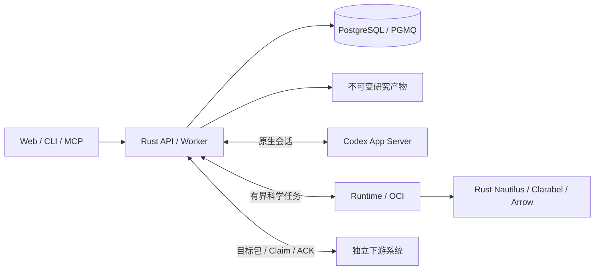

# QuaZonai

**把量化研究想法变成可追溯的证据与目标组合。**

QuaZonai 是面向独立研究者的单用户、自托管研究工作台：用 Rust 原生科学组件计算，用 Codex 组织有界研究，用独立评估与不可变记录约束结论，最后向下游交付 target-only 组合包。QZ 不持有券商凭据、不发送真实交易指令。

[快速体验](#quickstart) · [运行部署](OPERATIONS.md) · [架构导览](docs/architecture.md) · [参与贡献](CONTRIBUTING.md) · [验收证据](docs/architecture/issue-62-execution.md)

[](https://github.com/zhengui666/QuaZonai/actions/workflows/ci.yml)
[](https://github.com/zhengui666/QuaZonai/actions/workflows/web.yml)
[](https://github.com/zhengui666/QuaZonai/actions/workflows/native-runtime.yml)

> **当前为开发版本，完整产品生产验收仍未完成。** 合成界面预览可以直接运行；真实账号、授权数据、完整研究交付和恢复的验收状态统一见[证据索引](docs/architecture/issue-62-execution.md#acceptance)。徽章展示 main 的实际 CI，不是生产发布认证。
>
> **English:** A self-hosted quantitative research workbench for traceable evidence and target-only portfolio delivery. Development version; full production acceptance remains incomplete. Start with the credential-free preview below or the [contributor guide](CONTRIBUTING.md).


截图来自一次性数据库中的 Chromium → Rust API → PostgreSQL 验收，包含真实认证后的项目操作；不含认证秘密，不代表完整市场研究验收。[平板](docs/images/native-projects-768.png) · [手机](docs/images/native-projects-390.png)

## 为什么做这个项目

研究结果需要能够解释“用了什么、试了什么、为什么相信它”，而不仅是一次聊天或一张收益曲线。QuaZonai 围绕三个边界组织实现：

- **让研究可以追溯。** Brief、输入、预算、运行、产物和评估通过持久记录关联；失败和无效结论也属于研究结果。
- **让计算由专业组件完成。** 复用 Codex App Server、NautilusTrader、Clarabel、Arrow 和 PostgreSQL/PGMQ，QZ 负责领域约束、权限与证据关联。
- **让交付保留人的授权边界。** 资格、组合评估、审批与目标包领取各有明确合同；下游系统负责真实执行。

这些是产品设计与代码的组织原则。已实现入口、现有回归与尚未验收的场景见[覆盖表](docs/architecture/issue-62-execution.md#executable-coverage-map)，依赖版本和平台范围见[兼容矩阵](docs/architecture/compatibility-matrix.md)。

<a id="quickstart"></a>
## 快速体验

需要 Git、Node.js ≥22.12、npm 和 make；首次安装依赖需要访问 npm registry。无需数据库、模型账号或付费凭据：

```sh
git clone https://github.com/zhengui666/QuaZonai.git
cd QuaZonai
make demo-preview
```

打开 [http://127.0.0.1:4179](http://127.0.0.1:4179)。页面明确显示合成预览；创建或编辑一个项目、修改 Brief 草稿，再查看研究、组合和交付历史。按 **Ctrl+C** 停止；数据只保存在进程内存，重启清空，当前最多保留 256 次项目创建/编辑回执。

预览复用正式 React/Ant Design 界面和响应合同，但 Brief 冻结、研究执行和交付领取仍被拒绝；它不是完整 T02 Demo，也不连接真实 API、数据库、账号或下游。请勿输入真实凭据。真实服务从 [OPERATIONS 的首次启动](OPERATIONS.md#首次启动认证服务)开始，按文档完成数据库身份、原生 Codex、数据与 Runtime 配置。

## 系统如何组织



后端开发与原生运行基线为 Linux x86_64、Rust 1.98.1；前端为 React/TypeScript/官方 Ant Design。`server` 组织入口与 Worker，`contracts/domain/store/integrations` 分别承接合同、规则、事务和薄适配；`runtime/job` 执行原生任务。Rust crate 不等于独立微服务。详见[源码地图与请求调用链](docs/architecture.md)。

## 文档导航

| 想做什么 | 阅读 |
| --- | --- |
| 启动真实服务、配置账号/数据、处理升级与恢复 | [运行与部署](OPERATIONS.md) |
| 使用 CLI、HTTP、MCP，了解错误和重试 | [CLI 与协议](CLI.md)，以及实际 `server ... --help` |
| 修改代码、安装开发环境、选择测试 | [贡献指南](CONTRIBUTING.md) |
| 理解组件职责和真实调用链 | [架构导览](docs/architecture.md) |
| 查阅完整字段、状态机与验收定义 | [DESIGN](DESIGN.md)，唯一产品与架构事实源 |
| 查看实际测试覆盖、限制和下一步 | [实现证据与验收缺项](docs/architecture/issue-62-execution.md) |
| 构建和验证独立 Runtime | [原生 Runtime](runtimes/native/README.md) |
| 了解开发流程、review 和维护责任 | [OpenSDLC 项目上下文](.opensdlc/project.md)与 [AGENTS](AGENTS.md) |

OpenAPI 和前端类型/验证器由 Rust 合同及生成器产生；不另维护手写协议。路线图沿用[验收缺项](docs/architecture/issue-62-execution.md#acceptance)与 [GitHub Issues](https://github.com/zhengui666/QuaZonai/issues)，不在 README 复制完成清单或承诺日期。

## 开发与验证

按[贡献指南](CONTRIBUTING.md#set-up-a-checkout)安装固定工具链和依赖，然后从根目录选择检查：

```sh
make check-docs          # 本地文档链接、标题锚点与 server CLI help
make check-architecture  # Rust workspace 的直接依赖方向
make check-unit          # 格式、Clippy、无需数据库的 workspace 测试子集
make check-web           # 生成客户端一致性、类型、单元测试与正式构建
```

完整数据库/HTTP 检查使用 `make check`，需要显式配置可丢弃的 PostgreSQL18 + PGMQ1.10.0 和原生测试前提；`check-unit` 不替代它。真实 OCI、三视口/PWA 和真实 API 浏览器检查见[检查选择表](CONTRIBUTING.md#verify-the-change)。前端开发运行 `npm --prefix apps/web run dev`；开发代理仅接受回环 HTTP 地址，真实认证的 `PUBLIC_URL` 必须与浏览器 Origin 一致。

## 参与与反馈

欢迎提交可复现问题、测试、文档和聚焦的修复。先查[现有 Issue](https://github.com/zhengui666/QuaZonai/issues)与 [PR](https://github.com/zhengui666/QuaZonai/pulls)，较大功能或架构调整先讨论问题与方案。使用[贡献指南](CONTRIBUTING.md)完成验证，再按 [PR 模板](.github/PULL_REQUEST_TEMPLATE.md)说明改动和限制。维护者是 [@zhengui666](https://github.com/zhengui666)。

README 与贡献流程的取舍参考了 uv、Polars、NautilusTrader、Temporal 和 Zed 的官方资料；[调研记录与落地决定](.opensdlc/tasks/open-source-foundation/spec.md)保留来源及未采用的做法。

## License

原创代码保持 [AGPL-3.0-only](LICENSE)。第三方许可和版权说明见 [NOTICE](NOTICE) 与 [THIRD_PARTY_NOTICES](THIRD_PARTY_NOTICES.md)。
