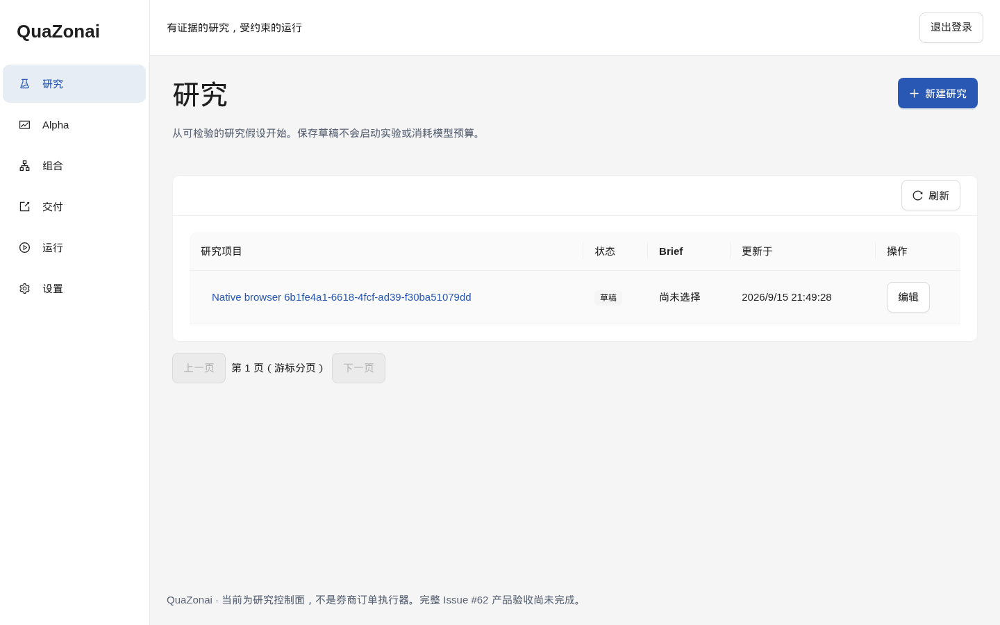

# QuaZonai

证据优先的自托管量化研究工作台：目标是将想法变成可追溯研究、合格Alpha和目标组合包，不是Broker、交易执行控制面或收益保证。

> **正在重写，尚不可作为完整产品部署。** 本分支已删除旧服务、旧前端和兼容层；不要沿用旧Docker/uv启动命令。当前可运行内容包括真实 Axum 认证/Project/机器凭据与不可变研究准备 API、本机初始化命令、Rust 合同/领域测试、PostgreSQL 逐轮 Store、原生科学计算和 Codex 协议探针。完整 Web 产品、研究/交付、迁移和恢复尚未通过验收，PR #63仍须保持Draft。

## 已有实现与边界

下图来自 2026-09-15 的真实 Chromium → Rust API → PostgreSQL 验收：在一次性测试实例中完成 TOTP 初始化和项目写入、丢失响应后的原键重试，再截取研究工作台。测试项目不是市场研究或收益证据，截图不代表完整 Demo/T42 已通过。



[平板视口](docs/images/native-projects-768.png) · [手机视口](docs/images/native-projects-390.png)。按下文 `npm run test:e2e:native` 复现；只有验收和资源清理成功，`test-results/native-summary` 才导出三个 `projects-*.png`，不截取认证页面。

| 内容 | 当前事实 |
|---|---|
| 原生回测 | Nautilus Rust 0.63.0 的原生不可变 Catalog 读取、受限预测和共享资金目标序列模拟；另保留明确标记 FIXTURE 的原生兼容探针。模拟结果不自动成为资格或交付证据 |
| 原生求解 | 本机与受管 OCI 入口绑定原优化器/聚合器和多 Alpha 预测，由 ndarray 聚合后送入 Clarabel Rust 0.11.1；Store 绑定原资格、来源与期限。历史单 BAR 参与率沿原 DATA_VALIDATE 报告进入求解及 Candidate 发布复核；不可行不补备用权重。完整成本、独立组合验证与交付尚未验收 |
| Arrow | Rust IPC RecordBatch写入/回读，明确FIXTURE不可交付 |
| Portfolio Mandate | 真实 API/CLI 与 Ant Design 配置创建、列表及不可变详情；原 Operator 事务/项目版本锁及 Runtime 模型、镜像、政策和执行引用检查；不是完整 Candidate/Release 交付 |
| Candidate 快照 | Store／API／CLI／Ant Design 查询已封口的原始头、成员和目标；保留执行、求解、证据状态与精确 Decimal，取消/失效候选不补目标。历史快照不授予当前资格，完整正向构建、独立验证与 Release 仍待验收 |
| Candidate 保持模拟 | Store／HTTP／CLI 从原 Candidate、费用及 Forward 来源申请原生 Run，冻结可用时间并保留原有效期；独立人工授权与原预算入队。不是策略 walk-forward 或已发表 Evaluation，完整科学与交付链仍待验收 |
| Release 冻结与查询 | HTTP/CLI及Ant Design从原候选独立评估确认冻结，按项目分页查看原版本/详情；未知结果保留原请求与幂等键。201不授审批，读取不刷新期限；交付记录页保留原Offer/Claim/ACK及前版关联，完整交付仍待验收 |
| Release 人工审批 | 原 Package/来源重验、PAPER/LIVE许可、下游新鲜观察、决定CAS与原报告引用同事务冻结；HTTP/CLI原授权及历史读取。人工Offer已接通原审批重验、重复版本防护和前后版本关联；下游Claim/ACK、显式审批撤销与Worker到期/撤销补记、原生能力观察自动刷新已接通；自动 Paper/Live 原生消费已接通；网页人工审批绑定原版本/决定并保留未知请求，网页Offer绑定原审批及完整分页中的最新前版，协议fixture不是生产验收 |
| 冻结自动化政策 | 原生HTTP/CLI与精确人工grant冻结版本、项目revision CAS、历史分页及追加撤销；旧版本与已领取事实不改写。自动 Paper/Live 原生消费已接通，网页可冻结新政策及查看历史，网页可追加政策撤销并保留原历史；登记不是交付 |
| 领域基础 | 精确UUIDv7/bigint/Decimal、预算、租约/终态、Codex覆盖及required指标判定；不是完整数据库权限证明 |
| 认证 API | Axum + PostgreSQL 原生会话、一次性本机初始化、六位 TOTP 登录、防重放、持久注销/设备撤销；普通服务使用非 owner 数据库角色 |
| Project 与机器身份 | 真正的项目分页/创建/更新、乐观并发、不可变命令回执、机器 token 一次性签发与撤销；机器只读授权项目，人工 CLI 管理操作另需原生 TOTP 单次授权 |
| 研究准备 | 同事务冻结输入集合、不可变评估政策与实验族登记；Validation/Sealed及可选组合指标独立冻结，未定义要求保留null。浏览器“组合/评估政策”可查看原版本、填写新政策并原键重试；登记意图不代表实际Sealed执行、PIT或PASS |
| 集成配置与探测 | 只写加密凭据、Runtime／Downstream 管理；Runtime 经部署允许列表和真实 TLS 探测，观察绑定配置版本与有效期。保存配置不等于连接成功 |
| 原生 Runtime | 已编写 SQLite 持久任务身份、固定 Docker 原生执行、不可变输入/输出、独立墙钟限制、取消屏障及恢复服务；普通 SQLite/HTTP/数值回归和独立必跑 OCI 验收明确分离。部署与实际验证入口见 [原生 Runtime](runtimes/native/README.md)，完整 Worker/研究资格链仍未完成 |
| Brief 与 Cycle 启动 | 正式冻结执行上下文和三个分区输入；启动时重验许可、当前 Runtime 能力与预算，在同一事务创建 Cycle、首个数据验证 Run、事件和 PGMQ 消息。不代表 Worker 已执行该任务 |
| PostgreSQL Store | 新库SQLx迁移、逐轮不可变预约/发送/结算、同Mission幂等与预算投影、关系唯一/复合外键；研究/评估权限全链路与 Worker 仍待完整验收 |
| Codex | 原生账号流程、模型配置、stdio MCP工具发现/调用及同Thread重启恢复适配；受控模型响应下验证文件边界和累计用量。真实账号与科学Job/Evaluation完整闭环仍待验收，Mission要求不带个人提示文件的专用profile |
| Ant Design Web/PWA | 已实现 TOTP 初始化/登录、研究项目与 Brief 草稿/冻结、显式双角色配置启动 Cycle、周期/准备 Run 查看、Run/SSE/取消、设备管理；桌面/平板/手机与更新提示。浏览器展示回归和真实入口测试分开记录；不代表全部研究业务完成 |
| 产物与 MCP | 同项目受限产物提交/不可变存储，按 Mission Attempt 授权和计量；官方 rmcp stdio 与固定 HTTP 工具适配。研究上传不是可信评估，不授予资格或审批 |
| Alpha 与正式评估查看 | API／CLI／Ant Design 按项目查看原 Alpha 版本、已发表的正式 Validation 和分页原始指标；保留缺值、方法、来源、精确计数与原有效期，不下载受限报告或把科学 PASS 当作资格 |
| 冻结试验选择 | 原研究 Mission 确认前冻结同 Family 全部登记试验，保留失败、取消、未完成、原指标、确定性排名及精确校准审阅目标；API／CLI／Ant Design 只读原快照。当前原生口径为 WALK_FORWARD，COMPLETE 不是科学 PASS 或资格，审阅目标不表示 Reviewer 已执行 |
| 冻结 SCORE 校准 | 原正式 Validation 同事务冻结最后原生折并创建同 Alpha 的附加校准新版本；原版本、试验、原评估不变，新版本不继承资格。API／CLI／Ant Design 只读原校准来源，不下载系数、不重新拟合或恢复已停用 Alpha |
| 独立 Reviewer | 研究成功ACK事务准入冻结配置的独立Run/Thread；原代码、参数和Validation上下文按目标审阅，原生公开回答绑定原Turn，预算不重置。真实App Server与文件工具、PGMQ原子回滚和重放已验证；上游回答受控，不是真实模型推理验收。审阅PASS不授资格 |
| 原生封存计算 | 本机入口及受管EVALUATE_SEALED_ALPHA复用目录、Wasm、冻结校准和原生指标；真实OCI执行已验证。Operator可经API／CLI／Ant Design使用原模型请求评估；独立Reviewer的原PASS目标也由可信Worker使用同一准备器自动入队，不借人工授权、不重复收费原编译试验。首次能力返回前按原Attempt预约根血缘机会，取消不退款；Worker在ACK前发表原SEALED评估及全部指标。资格裁决与验收边界见下行 |
| 原证据资格裁决 | 原独立Reviewer关联的封存ACK已接入精确版本/政策资格，重验原数据与许可并限制期限；FIXTURE科学PASS拒绝发证与PostgreSQL语句检查已通过。真实数据正向授予、资格查询/披露及交付使用仍未验收 |
| 交付与完整研究 | Sealed／Reviewer／Alpha资格完整链、组合/审批/反馈/晋级/唤醒、旧数据导入及完整恢复仍在实施；未接通的页面明确标示，不填充假结果 |

## 开发验证

### 尚未完成的交付验收

当前没有可声明为“一条命令完整演示”的无凭据 Demo。`apps/web/tests/pwa-server.mjs` 仅用于 Service Worker 生命周期测试，不能作为完整业务演示或部署入口。

已安装 Node.js ≥22.12、npm 和 make 的开发环境可在仓库根目录运行 `make demo-preview`；该命令按锁文件安装前端依赖，然后在 `http://127.0.0.1:4179` 启动开发中的只读合成预览，按 Ctrl+C 停止。它复用正式界面及原生响应合同，展示冻结 Brief、无合格候选的周期与试验选择、两个 Alpha、冻结组合配置、执行假设、评估政策及资格不足的无目标候选；另有停用 Runtime、过期许可、投资域和按分区筛选的 FIXTURE 元数据。它拒绝全部写入与 Claim，不连接真实 API、数据库或账号。完整交付与编辑交互仍待补齐，不能替代 T02/T42；请勿在预览中输入真实凭据。已有依赖时可直接运行 `npm --prefix apps/web run demo:preview`。

以下证据仍须按 [DESIGN 验收合同](DESIGN.md) 补齐，不能以局部测试通过替代：

- T02：明确标记 synthetic/fixture、不能生产领取的完整 UI Demo。
- T07/T08：受保护真实账号登录流程，以及模型调用真实 Job/Evaluation 后在同一 Thread 消费证据的闭环。
- T39/T40：实际旧快照及其产物的完整迁移、恢复和故障演练。
- T41/T42：全部文档命令与示例实际执行，以及新实例通过 Web、CLI 分别完成研究到 Paper/Forward 的完整流程。

CI 和浏览器截图证明的范围以各测试内容为准。审批、合并和 Issue 关闭仍须满足最新提交的全部交付条件。

需要Linux x86_64、原生Rust 1.98.1工具链和C工具链；Nautilus发布族2.0.0rc4仍为RC，不隐瞒预发行风险。此路径不安装Python。

```sh
cargo fmt --all -- --check
cargo clippy --locked --workspace --all-targets -- -D warnings
cargo test --locked --workspace --exclude store --exclude server
cargo build --locked --workspace --all-targets
cargo run --locked -q -p contracts --example generate > /tmp/domain-v1.openapi.json
diff -u contracts/generated/domain-v1.openapi.json /tmp/domain-v1.openapi.json
```

上述命令明确只运行不依赖数据库的单元/原生测试，不等于全量检查。

完整 workspace 检查必须设置指向**可丢弃测试实例**的 `DATABASE_URL`；实例需要 PostgreSQL18、PGMQ1.10.0，以及仅供测试的创建数据库权限。不得使用生产 URL，SQLx 为各测试创建独立新库并应用迁移。缺少连接应失败，而不是跳过：

```sh
# DATABASE_URL must already refer to the disposable test instance described above.
make check
# Run only the actual PostgreSQL transaction/constraint tests:
make check-store
# Test actual Axum routes, cryptography and independent PostgreSQL databases:
make check-http
```

`make check-unit` 是无数据库的明确子集；不能拿其通过替代 Store 测试。
新 CI 的 `store-postgres` job 使用固定原生 PGMQ 镜像，整体基础检查依赖该 job 成功。
这仍不代表 Web/CLI 完整产品或受保护真实账号验收。

执行原生fixture，输出目录必须不存在：

```sh
cargo run --locked -p job -- verify-native --output /tmp/quazonai-native-example
```

`native-probe.json`仅在完整写入/同步后发布；`origin=FIXTURE`、`deliverable=false`。结果不是收益证明，不能生成正式审批/交付。失败、已有目录或不可行约束不会返回隐藏的成功/单资产兜底。

Codex无账号协议探针：

```sh
npm ci --prefix runtimes/codex --ignore-scripts --no-audit --no-fund
export CODEX_NATIVE_BIN="$PWD/runtimes/codex/node_modules/@openai/codex-linux-x64/vendor/x86_64-unknown-linux-musl/bin/codex"
export CODEX_PROBE_DIR=/tmp/quazonai-codex-example
cargo build --locked -p job --example codex_contract
timeout --kill-after=5s 90s target/debug/examples/codex_contract
```

这使用独立空profile，不读取或修改宿主登录。真实SYSTEM/官方订阅/custom-provider路径不可被此探针替代。

## Web 开发与真实浏览器验证

`apps/web` 使用官方 Ant Design 与原生生成的 HTTP 类型/运行时验证器。UI 的 API 始终同源；开发代理仅接受显式的回环地址，不从 `.env` 注入后端或秘密。运行 Rust API 的迁移、私有状态目录及公共 Origin 设置见 [CLI](CLI.md)。

```sh
cd apps/web
npm ci --ignore-scripts --no-audit --no-fund
npm run generate
npm run typecheck
npm test
npm run build
node node_modules/@playwright/test/cli.js install chromium
npm run test:e2e
```

三视口与 PWA 套件使用明确的合成界面合同；真实服务另行执行 `npm run test:e2e:native`。该命令要求显式 `QUAZONAI_WEB_TEST_ADMIN_URL` 指向可丢弃的回环 PostgreSQL18/PGMQ1.10 实例，并已构建 `target/debug/server`。它创建独立应用角色和新库，执行真实初始化/TOTP、项目写入与丢 ACK 重试、CSRF 拒绝、布局和退出失效，结束仅删除自己创建的测试资源。不要传生产地址，也不要把原始绑定诊断或验证码上传到 CI artifacts；公开证据只有脱敏摘要。

上述入口已能操作当前实现的研究组织与运行管理，**不代表 Alpha、组合和目标交付全链路已经完成**。完整生产部署和 T42 仍须独立验收。

## 文档

- [完整设计和验收合同](DESIGN.md)
- [Rust复用调查与Python例外证据](docs/research/reuse.md)
- [治理](AGENTS.md)、[实际命令](CLI.md)、[运行限制](OPERATIONS.md)
- [实现证据](docs/architecture/issue-62-execution.md)、[兼容矩阵](docs/architecture/compatibility-matrix.md)

目录不用qz-前缀；旧代码只存在Git历史，源码清理不删除用户数据。Rust可用就用Rust，Python须先提交具体能力证据。不自研成熟数值、认证、Agent、队列或容器平台。

完整W0–W8/T01–T42、最新Head全部适用CI、明确无问题Codex review和零未解决线程之前不得合并；旧测试删除或少数检查绿色不代表完整产品通过。


## 已实现的认证 API

`apps/server` 已提供真实 Axum 认证服务与本机 `init-state`、`migrate`、`bootstrap` 命令，
复用 tower-sessions/PostgreSQL、totp-rs、Argon2 和 RustCrypto。初始化需要本机一次性
capability；正常登录只提交六位 TOTP。注销、设备撤销、认证 epoch 与重放检查由数据库
持久化，旧 cookie 不能恢复已撤销权限。运行步骤见 [CLI](CLI.md) 和 [运维](OPERATIONS.md)。

这是可运行的认证 API，不是研究产品已全部完成的声明；前端、研究/组合/交付全链路
仍须按 DESIGN 实现和验收。API 合同由 `server openapi` 从实际路由生成，不手写平行协议。

## License

原创代码保持[AGPL-3.0-only](LICENSE)。第三方代码保留上游许可证，Nautilus示例保留LGPL版权说明，见[NOTICE](NOTICE)和[第三方说明](THIRD_PARTY_NOTICES.md)。

### Run 与事件接口增量

已实现受信任 Store 的事务准入、同 Attempt 接管/取消/终态回执，以及带认证的
Run 查询、取消和持久 SSE HTTP；完整路径和权限见 [CLI](CLI.md)。这不代表
完整 Worker/远端隔离、研究业务、科学资格、前端或交付闭环已完成。

### Brief 草稿作者流程

现有控制面还支持研究Brief草稿的真实创建、读取、版本化和完整替换，包含当前机器权限、近期人工认证、原始响应幂等和数据库CAS。接口与授权形状见[CLI.md](CLI.md)。冻结后的内容和数据绑定不可改写；本条不表示完整Brief冻结、原生研究、组合交付或Web产品已验收。

后续增量已接通正式Brief冻结、显式Profile选择、Cycle原生数据准备、Mission事务准入和唯一Thread回执存储。Mission与科学计算复用现有队列而分别选择任务；原生Codex驱动、原Thread评估反馈和冻结选择已有受控测试，科学Job/OCI一体链路、真实账号与完整产品验收仍须继续，详见[执行证据](docs/architecture/issue-62-execution.md)。

自动 Paper：ACTIVE 项目当前有效 AUTO_PAPER/AUTO_HANDOFF 政策由 Worker 轮询消费，原审批和 Offer 同事务产生。每日限额按数据库 UTC 日、原项目/下游及不同 Candidate 计数，包含人工记录；换政策版本不重置。政策替换、禁用或撤销阻止未领取记录继续领取，已领取事实不改写。`client handoff list PROJECT_UUID --limit 50`（可选 `--cursor UUID`）查询原绑定与当前状态；下游凭据仅见自己的记录。Live 自动晋级已接入同一 Worker，条件与证据边界见下段。

自动 Live：仅当前有效 AUTO_HANDOFF 政策可消费原 Candidate/下游的 Paper 观察。全部已报告原 Paper Handoff/stream 均须有当前原生 HEALTHY 观察，每个流分别满足样本数、完整窗口时长与两组指标；不合并样本或挑选有利流，超过255个流拒绝。审批与Offer同事务冻结完整排序的观察UUID集合；首次Claim重验同一集合、完整来源、Live数据用途、Release与下游readiness。新流、更正、撤权或过期会阻止旧证据继续授权；已有Claim重放保持原事实。同一Candidate当日Paper/Live合计占一次额度。人工Live审批行为不变，完整市场/部署验收与界面仍未完成。

Forward 报告：原 Handoff 领取后，精确项目/下游 FORWARD_SUBMIT 凭据使用 `client --idempotency-key MESSAGE_ID forward submit < forward-message.json` 提交 ForwardMessageSubmitV1（完整字段见 DESIGN A7.3）。external_message_id 必须与请求头/CLI的MESSAGE_ID一致，是原幂等编号，未知结果保持原报告重试；换编号重传相同逻辑消息也只返回原记录。纠正必须引用最新原消息、revision加1并保留窗口。三个时间使用UTC微秒精度；原始收益报告仅保存在EVALUATOR_ONLY Artifact，不能夹带账户/NAV/订单或执行权限字段。`client forward list PROJECT_UUID --limit 50 --cursor UUID`只读元数据；首次省略cursor，下游仅见自己的记录。收到报告不表示连续窗口、统计评估或Live晋级已通过，这些消费链仍在实现。

`client forward window HANDOFF_UUID --stream STREAM`读取原始窗口来源投影：最新纠正版、连续性、合格样本数及缺序/partial/缺失/重叠原因。partial纠正不会回退旧complete版本，任一缺口或重叠将合格计数清零；原报告仍不公开。空stream返回NO_MESSAGES。此投影尚不是已封口的Forward统计评估，不授予自动Live或Wake资格；完整字段与原生来源/容量边界见DESIGN A7.4。

Forward收益频率：报告可声明 `returns_frequency=UTC_DAY`（完整UTC日，样本为右端午夜，complete不得缺日）或 `REPORTED_OBSERVATION`；缺失表示未知，不能推断日频/年化或独立样本。同stream含纠正历史的频率不一致时窗口返回 `FREQUENCY_MISMATCH`、合格计数为0。此来源检查尚不等于原生ForwardEvaluate完成。

原生 ForwardEvaluate 科学job已支持冻结原REPORT输入、原纠正链重验及nautilus-analysis 0.63.0的UTC日均值/波动率/Sharpe（365日年化）。Runtime仅在明确登记FORWARD_EVALUATE固定镜像后宣布该能力；不接受额外目录/模型。当前已具备受冻结政策约束的Store准入与原Run/PGMQ队列，已接原Worker终态Evaluation/window发布，自动调度已接通，原生观察、待处理Wake及受限Cycle消费已接通，尚待Live晋级，不把直接job结果当作Live/Wake资格；输入/结果/上限见DESIGN A7.5。

Forward可信准入仅供内部Worker调用：沿用原Candidate Runtime，完整原日频报告在项目锁内冻结为受限FORWARD输入，固定30CPU秒/60墙钟秒/512MiB/1MiB输出、无Cycle并发2，同来源重放不新增Run。纠正、撤销、替换或过期会阻止未发送任务；普通InputSet接口仍不能复制受限报告。原Worker会在终态采纳后、ACK前发表测量Evaluation与封口窗口，decision为INCONCLUSIVE；更正/撤权/过期或不完整统计不产生有效样本。Worker沿用五秒项目轮询，每轮至多预约一个原反馈流，失败三十秒后公平重试，新增/纠正可提前重试；相同来源不重复入队。Worker在ACK前按原政策追加原生观察：维持要求不通过为DEGRADED，维持通过但晋级要求不通过为WATCH，两组通过为HEALTHY，缺失/过期/无效为INSUFFICIENT_DATA。只有当前有效DEGRADED追加唯一待处理Wake；观察/Wake失败保留原消息重试。Wake消费复用原人工研究上下文及冷却/日额度；Live晋级消费完整原生HEALTHY观察集合，详见DESIGN A7.6–A7.11。


原生退化 Wake 由现有可信 Worker 自动化轮询消费，继承原 Candidate 研究 Cycle 的
人工 Brief/Profile 上下文并重验当前数据/运行时/政策。冷却与 UTC 日额度不足延后；
暂停保留待处理记录，更正/过期/撤权取消旧 Wake。与 DATA_VALIDATE/PGMQ/startup
同事务绑定唯一新 Cycle，不发放 Operator 身份或交付权限。无 Agent/HTTP 手动强制
消费入口；可用 `cargo test --locked -p store --test forward_evaluation --test cycles`
验证原生事务和受控协议，不能把该测试称为真实多日反馈/模型/OCI验收。
