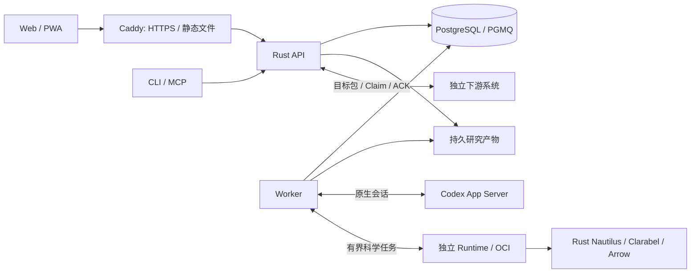

# QuaZonai

**把量化研究想法变成可追溯的证据与目标组合。**

QuaZonai 是面向独立研究者的单用户、自托管研究工作台。Rust 原生组件负责科学计算，Codex 组织有界研究，独立评估约束结论，最终向下游交付 target-only 组合包。QZ 不持有券商凭据，不发送真实交易指令。

[个人部署](docs/user-guide.md) · [使用与恢复](OPERATIONS.md) · [界面预览](#quickstart) · [架构](docs/architecture.md) · [参与贡献](CONTRIBUTING.md)

[](https://github.com/zhengui666/QuaZonai/actions/workflows/ci.yml)
[](https://github.com/zhengui666/QuaZonai/actions/workflows/web.yml)
[](https://github.com/zhengui666/QuaZonai/actions/workflows/native-runtime.yml)

> **当前仍为开发版本，完整生产验收未完成。** 真实服务部署与无凭据界面预览是两条不同路径。服务启动、部署模板和 CI 通过不证明真实账号、授权数据、完整研究交付或恢复已验收；实际状态见[验收证据](docs/architecture/issue-62-execution.md#acceptance)。
>
> **English:** A personal, self-hosted quantitative research workbench for traceable evidence and target-only portfolio delivery. Full production acceptance remains incomplete. See the [personal-hosting guide](docs/user-guide.md) or try the explicitly synthetic preview below.


截图来自一次性数据库中的 Chromium → Rust API → PostgreSQL 验收，包含真实认证后的项目操作；不代表完整市场研究验收。[平板](docs/images/native-projects-768.png) · [手机](docs/images/native-projects-390.png)

## 为个人研究而设计

研究结果应该能回答“用了什么、试过什么、为什么相信它”，而不只是一次聊天或一张收益曲线。QuaZonai 将 Brief、输入、预算、运行、产物和评估关联到持久记录，失败与无效结论也被保留。科学能力复用 Codex App Server、NautilusTrader、Clarabel、Arrow 和 PostgreSQL/PGMQ；QZ 只负责自身的规则、权限和证据关联。

从研究结果到目标交付，资格、组合评估、人工授权与下游领取有各自的边界。页面显示的历史成功不等于当前资格；目标包交付也不是实际成交。已实现入口和未验收场景见[覆盖表](docs/architecture/issue-62-execution.md#executable-coverage-map)。

## 个人部署：真实服务与持久数据

[个人部署指南](docs/user-guide.md)给出 Linux 上的正式构建、独立状态目录、API/Worker 服务托管、同源 HTTPS 网关、升级与恢复路径。网页由 Caddy 提供静态文件，真实请求进入 Rust API；API 与 Worker 使用同一份持久数据和配置。它不是 `vite preview`，也不会在服务启动时自动创建密钥或执行数据库迁移。

运行前需要准备 PostgreSQL/PGMQ、独立数据库身份和正确的公开 HTTPS Origin。原生 Codex 配置、授权数据与独立 Runtime 是实际研究的额外前提；空配置不会被伪装成就绪。先在可丢弃环境完成[验收与恢复检查](docs/user-guide.md#recovery)，再决定是否用于自己的正式工作。完整配置和操作仍以 [OPERATIONS](OPERATIONS.md) 为准。

<a id="quickstart"></a>
## 无凭据界面预览

只看界面时，需要 Git、Node.js ≥22.12、npm 和 make；首次安装需要访问 npm registry：

```sh
git clone https://github.com/zhengui666/QuaZonai.git
cd QuaZonai
make demo-preview
```

打开 [http://127.0.0.1:4179](http://127.0.0.1:4179)。页面明确标注合成预览；可以临时创建或编辑项目、修改 Brief 草稿，并查看示例研究、组合与交付记录。按 **Ctrl+C** 停止。数据只在进程内存中，重启清空；最多保留 256 次项目创建/编辑回执。

预览复用正式 React/Ant Design 界面和响应合同，但 Brief 冻结、研究执行和交付领取被禁用。它没有真实 API、数据库、账号或下游，也不等于完整 T02 Demo。请勿输入真实凭据；不要把预览进程接到个人部署的网关后面。

## 系统结构



后端构建基线为 Linux x86_64、Rust 1.98.1；前端为 React/TypeScript/官方 Ant Design。Rust crate 不等于独立微服务；网关不管理业务会话，systemd 不替代研究队列或 Runtime 恢复日志。组件职责和真实调用链见[架构导览](docs/architecture.md)，依赖与平台范围见[兼容矩阵](docs/architecture/compatibility-matrix.md)。

## 文档导航

| 目标 | 入口 |
| --- | --- |
| 安装与托管自己的实例、处理启动与页面故障 | [个人部署指南](docs/user-guide.md) |
| 配置账号、数据与 Runtime，操作研究、交付、升级与恢复 | [运行手册](OPERATIONS.md) |
| 使用 CLI、HTTP、MCP 与错误重试 | [CLI 与协议](CLI.md)及实际 `server ... --help` |
| 理解模块职责、接口边界与请求调用链 | [架构导览](docs/architecture.md) |
| 查阅字段、状态机与完整验收合同 | [DESIGN](DESIGN.md) |
| 查看覆盖、限制和剩余工作 | [实现证据](docs/architecture/issue-62-execution.md) |
| 开发、测试与贡献 | [CONTRIBUTING](CONTRIBUTING.md)、[AGENTS](AGENTS.md)、[OpenSDLC](.opensdlc/project.md) |

OpenAPI、前端类型与响应验证器由 Rust 合同及生成器产生，不维护另一份手写协议。产品合同集中在 DESIGN；运行手册与源码导航不另建业务事实。

## 开发与验证

按[贡献指南](CONTRIBUTING.md#set-up-a-checkout)准备工具链与依赖，然后选择与改动有关的检查：

```sh
make check-docs          # 文档链接、标题锚点与原生 CLI help
make check-architecture  # Rust workspace 直接依赖边界
make check-unit          # 格式、Clippy、无需数据库的测试子集
make check-web           # 生成客户端、类型、单元测试与正式构建
CADDY_BIN=/path/to/caddy node --test deploy/proxy.test.mjs
```

完整数据库/HTTP 检查使用 `make check`，需要可丢弃的 PostgreSQL18 + PGMQ1.10.0 和原生测试前提；单元测试不能替代它。三视口/PWA、真实 API 浏览器与 OCI 检查见[检查选择表](CONTRIBUTING.md#verify-the-change)。网关测试使用真实 Caddy 和合成 HTTP 对端，只验证网关行为，不证明真实研究或生产部署。

欢迎通过 [Issues](https://github.com/zhengui666/QuaZonai/issues) 提交可复现问题，通过 [PR](https://github.com/zhengui666/QuaZonai/pulls) 提交聚焦的实现与测试。按 [PR 模板](.github/PULL_REQUEST_TEMPLATE.md)说明实际验证与限制；维护者是 [@zhengui666](https://github.com/zhengui666)。

## License

原创代码保持 [AGPL-3.0-only](LICENSE)。第三方许可与版权说明见 [NOTICE](NOTICE) 和 [THIRD_PARTY_NOTICES](THIRD_PARTY_NOTICES.md)。
