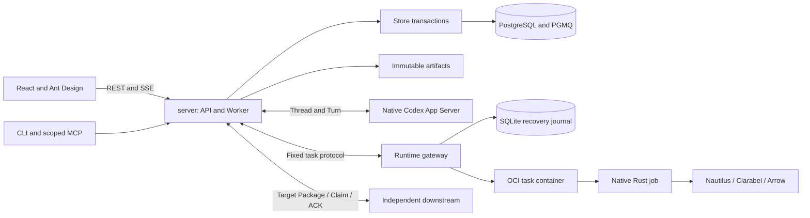

# Architecture guide

This page is a source-navigation guide. [DESIGN](../DESIGN.md) owns the architecture, domain rules and acceptance contracts; [the evidence index](architecture/issue-62-execution.md) owns implementation coverage and remaining product acceptance. Component presence is not an end-to-end acceptance claim.

## System context

QuaZonai organizes bounded research and delivers immutable target-only portfolio packages. Operators supply intent and authorization; Codex supplies native model sessions; scientific libraries supply computation; independent evaluation determines eligibility. Downstream systems own execution. See DESIGN sections 2, 6 and 8 for the exact ownership rules.

## Components and flow

Arrows show communication, not authorization or exactly-once delivery. The control plane and Runtime have different journals and failure boundaries; Rust crates are not individually deployed microservices.

| Location | Responsibility / first source to read | Existing verification |
| --- | --- | --- |
| [contracts](../crates/contracts/src/lib.rs) | Wire types, scalar precision, generated domain schemas | [contract tests](../crates/contracts/tests), [wire cases](../tests/contracts) |
| [domain](../crates/domain/src/lib.rs) | QZ rules and validated scientific adapters, without HTTP or SQLx | [domain tests](../crates/domain/tests) |
| [store](../crates/store/src/lib.rs) | Transactions, authority, immutable facts, queue and result adoption | [Store tests](../crates/store/tests), [migrations](../migrations) |
| [integrations](../crates/integrations/src/lib.rs) | Native authentication, secret, artifact and Mission-file primitives | [integration tests](../crates/integrations/tests) |
| [server](../apps/server/src/lib.rs) | Routes, identity, CLI/MCP, Worker and native service adaptation | [server tests](../apps/server/tests) |
| [runtime](../apps/runtime/src/lib.rs) | Task admission, OCI supervision, journal and reconciliation | [runtime tests](../apps/runtime/tests) |
| [job](../apps/job/src/lib.rs) | Bounded computation using upstream Rust engines | [job tests](../apps/job/tests) |
| [web](../apps/web/src) | React/Ant Design UI, typed API, request recovery and PWA | Colocated tests and [browser suites](../apps/web/tests) |

### Trace a research startup

1. [Web cycle controls](../apps/web/src/cycles.tsx) or the [CLI client](../apps/server/src/client) submit the typed command. [Server cycle routes](../apps/server/src/cycles.rs) extract authority, parse the body and preserve the idempotency key; `start` returns HTTP 202 for admission.
2. [Store cycle admission](../crates/store/src/cycles.rs) validates the frozen context, publishes the bounded input artifact and uses the [shared lifecycle transaction](../crates/store/src/lifecycle.rs) to persist Run/admission/event/queue state. The domain rules do not commit transactions themselves.
3. The [trusted Worker](../apps/server/src/worker.rs) claims work, creating the leased Attempt through Store, and uses [Runtime transport](../apps/server/src/runtime_transport.rs); the [Runtime engine](../apps/runtime/src/engine.rs), [journal](../apps/runtime/src/journal.rs) and [supervisor](../apps/runtime/src/supervisor.rs) manage native execution and recovery.
4. [Managed job dispatch](../apps/job/src/managed.rs) invokes the selected scientific task. Results return through Worker/Store adoption, bound to the original attempt and evidence. [Run endpoints](../apps/server/src/runs.rs) expose persistent progress; downstream delivery has separate qualification, approval and Claim/ACK contracts.

This trace identifies code to inspect; it does not assert that one request has completed the entire scientific and delivery workflow. Regression entrypoints include [atomic cycle admission](../crates/store/tests/atomic_cycle_admission.rs), [cycle HTTP](../apps/server/tests/cycles_http.rs) and [native Worker](../crates/store/tests/native_worker.rs).

## Boundaries and contracts

The direct Rust dependency rules are defined once in DESIGN section 3 and checked by [the architecture test](../crates/contracts/tests/architecture.rs). `make check-architecture` uses native Cargo metadata, including renamed dependencies and target-specific declarations; test-only dependencies are intentionally outside that check. It cannot prove a semantic boundary merely from a graph, so reviewers must still trace behavior.

[Generated OpenAPI](../contracts/generated) comes from Rust wire types and actual HTTP routes. [The web generator](../apps/web/scripts/generate-validators.mjs) produces response validators from the server schema; hand-maintained parallel protocols are not accepted. See [CLI generation commands](../CLI.md#原生组件与合同验证).

For correctness across failures, read DESIGN A6/A8 and B5/B6: an unknown response preserves the original request and idempotency key; cancellation intent does not prove remote termination; stale attempts cannot publish current results; reads do not renew eligibility. Use [OPERATIONS](../OPERATIONS.md) for the actual recovery actions.

## Accepted decisions

- Reuse native scientific engines, Codex, SQLx/PGMQ and OCI; QZ owns domain coordination and evidence relationships (DESIGN 0–3; [reuse research](research/reuse.md)).
- Keep one canonical product design and generate wire contracts. Source and native CI carry evidence, with [version/platform limits](architecture/compatibility-matrix.md) stated explicitly.
- Remove obsolete implementations without maintaining compatibility wrappers; preserve data, backups, license notices and explicit migration semantics (DESIGN 11).

## Verification and operation

Use [CONTRIBUTING](../CONTRIBUTING.md#verify-the-change) to select checks, [OPERATIONS](../OPERATIONS.md) for real service setup/recovery, and [OpenSDLC operations](../.opensdlc/operations.md) for development/release authority and maintenance feedback. The [remaining acceptance](architecture/issue-62-execution.md#acceptance) is separate from this source map.
